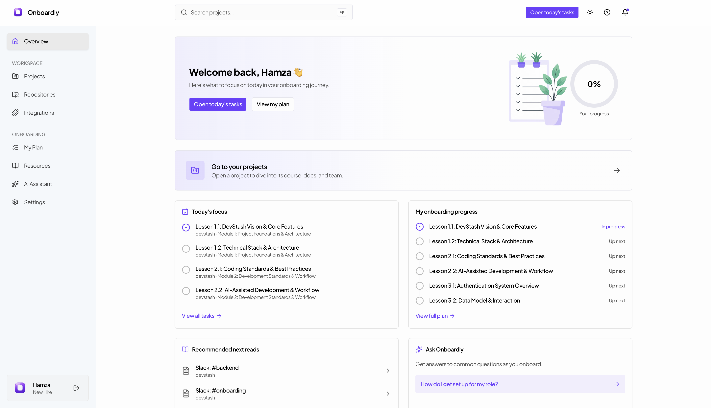
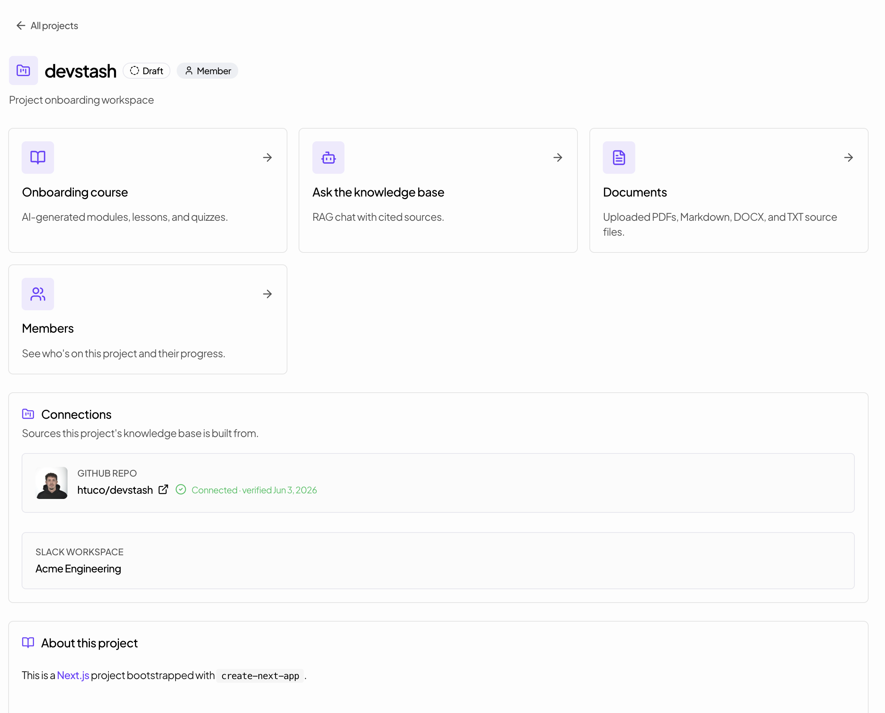
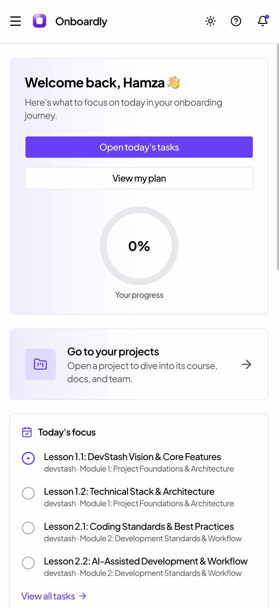
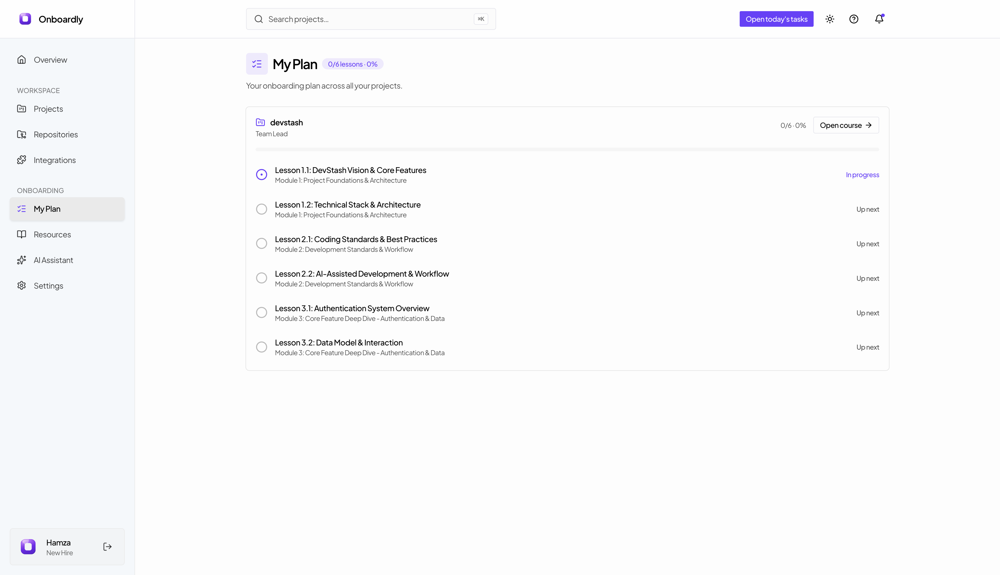
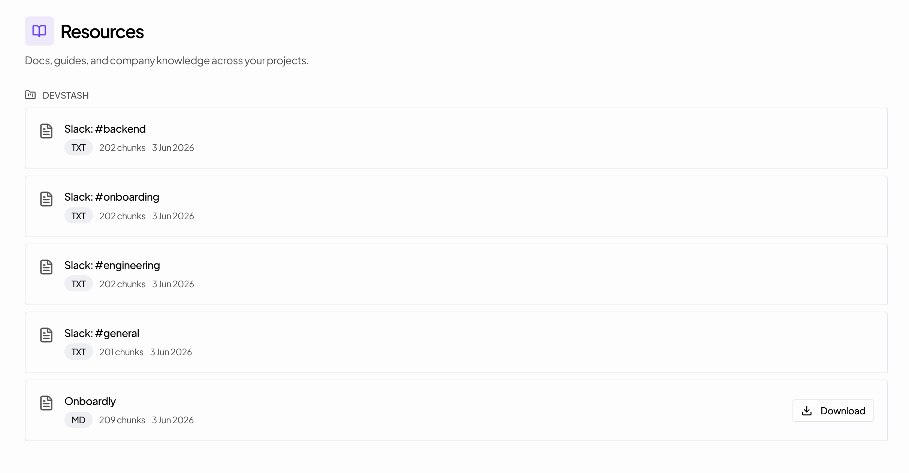
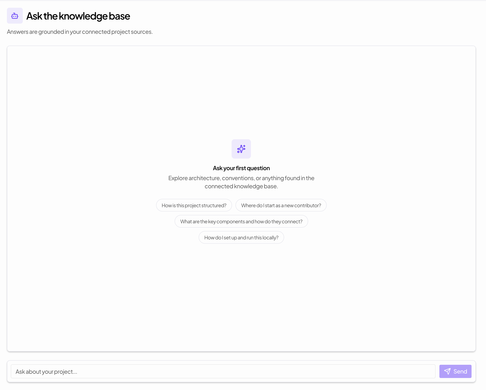
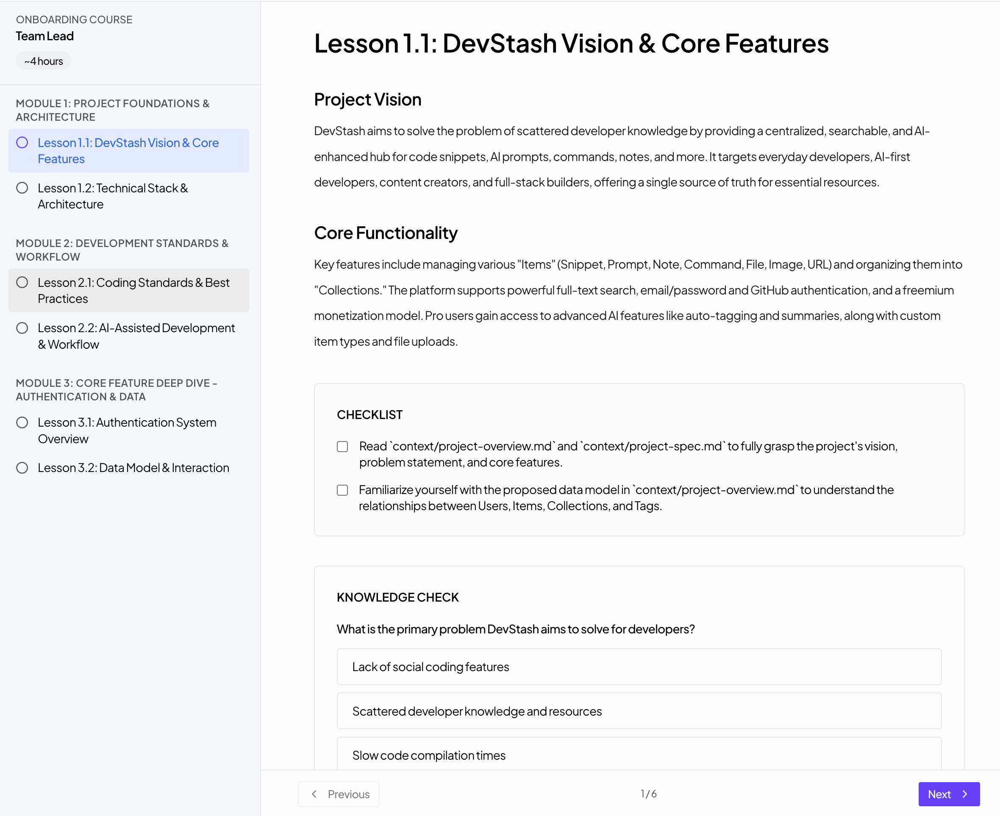
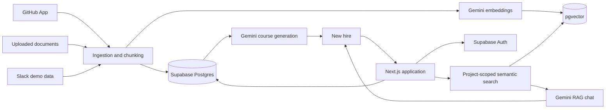

<div align="center">
  
  <h1>Onboardly</h1>
  <p><strong>An AI-powered onboarding workspace grounded in your codebase, documents, and team knowledge.</strong></p>
  <p>Built by <strong>Team Heap</strong> for the <strong>FEP AI Hackathon 2026</strong>.</p>
  <p>
    <a href="https://nextjs.org/"></a>
    <a href="https://react.dev/"></a>
    <a href="https://www.typescriptlang.org/"></a>
    <a href="https://tailwindcss.com/"></a>
    <a href="https://supabase.com/"></a>
    <a href="https://www.prisma.io/"></a>
    <a href="https://ai.google.dev/"></a>
  </p>
</div>

---

## Overview

Onboardly helps new hires become productive without hunting through scattered
repositories, documents, chat history, and tribal knowledge. Teams create a
project workspace, connect its knowledge sources, invite members, and generate a
role-specific onboarding experience.

The assistant uses retrieval-augmented generation (RAG) over project-scoped
knowledge. Answers are grounded in indexed source chunks and returned with
citations, while onboarding courses turn the same knowledge into guided lessons,
checklists, and quizzes.

## Highlights

- **Project workspaces** with admin/member roles and project-scoped access.
- **GitHub integration** for repository browsing, GitHub App connection, codebase
  sync, and collaborator discovery.
- **Document knowledge base** for PDF, DOCX, Markdown, and text uploads.
- **Gemini embeddings + pgvector search** for project-specific semantic
  retrieval.
- **RAG chat with citations** and persisted conversation history.
- **AI-generated onboarding courses** with modules, lessons, tasks, quizzes, and
  completion tracking.
- **New-hire dashboard** for focus items, progress, recommended reads, and recent
  activity.
- **Responsive light and dark UI** built with shadcn/ui and semantic Tailwind
  tokens.

> Slack sync is included as a demo pipeline backed by mock workspace data. The
> production Slack API client is intentionally left for a future integration.

## Screenshots

<p align="center">
  
  <br />
  <sub><strong>New-hire dashboard</strong> — today's focus, onboarding progress, recommended reads, and project access in one place.</sub>
</p>

<table>
  <tr>
    <td width="72%">
      
    </td>
    <td width="28%">
      
    </td>
  </tr>
  <tr>
    <td align="center"><strong>Project workspace</strong><br /><sub>Courses, chat, documents, members, and connected knowledge sources.</sub></td>
    <td align="center"><strong>Responsive dashboard</strong><br /><sub>Onboarding tasks remain accessible on mobile.</sub></td>
  </tr>
</table>

<table>
  <tr>
    <td width="50%">
      
    </td>
    <td width="50%">
      
    </td>
  </tr>
  <tr>
    <td align="center"><strong>My Plan</strong><br /><sub>A clear path through assigned lessons and progress.</sub></td>
    <td align="center"><strong>Resources</strong><br /><sub>Project knowledge from repositories, documents, and synced sources.</sub></td>
  </tr>
</table>

<table>
  <tr>
    <td width="50%">
      
    </td>
    <td width="50%">
      
    </td>
  </tr>
  <tr>
    <td align="center"><strong>Knowledge-base chat</strong><br /><sub>Grounded questions and cited answers from connected sources.</sub></td>
    <td align="center"><strong>AI-generated course player</strong><br /><sub>Guided lessons, checklists, and knowledge checks.</sub></td>
  </tr>
</table>

## Product Flow

1. Sign in with GitHub or create an email account.
2. Create a project and select an available GitHub repository.
3. Install and verify the Onboardly GitHub App for repository access.
4. Sync repository content or upload internal documents.
5. Generate embeddings to build the project knowledge base.
6. Invite repository collaborators as project members.
7. Ask cited questions or generate a role-specific onboarding course.
8. Track progress from the project workspace and personal dashboard.

## Architecture



Onboardly is a single full-stack Next.js App Router application. Server
components, API routes, auth, project access checks, ingestion pipelines, and the
UI live in one TypeScript codebase.

### GitHub OAuth vs. GitHub App

Onboardly uses two distinct GitHub integrations:

| Integration                   | Purpose                                                                                |
| ----------------------------- | -------------------------------------------------------------------------------------- |
| **GitHub OAuth via Supabase** | Signs users in and lists repositories visible to their GitHub account.                 |
| **Onboardly GitHub App**      | Grants persistent repository access for syncing content and discovering collaborators. |

## Tech Stack

| Area             | Technology                                    |
| ---------------- | --------------------------------------------- |
| Application      | Next.js 16, React 19, TypeScript              |
| UI               | Tailwind CSS 4, shadcn/ui, Radix UI, Lucide   |
| Database         | Supabase Postgres, Prisma ORM                 |
| Vector search    | Supabase pgvector                             |
| Authentication   | Supabase Auth, GitHub OAuth, email/password   |
| File storage     | Supabase Storage                              |
| AI               | Google Gemini 2.5 Flash, Gemini Embedding 001 |
| Integrations     | GitHub App, GitHub REST API, Slack demo sync  |
| Document parsing | `pdf-parse`, `mammoth`                        |

## Repository Structure

```text
heap-onboarding-assistant/
├── README.md
└── onboardly/
    ├── prisma/
    │   ├── schema.prisma
    │   └── seed.ts
    ├── public/
    ├── scripts/
    └── src/
        ├── app/
        │   ├── (public)/           # Landing, login, registration, terms
        │   ├── (auth)/             # Dashboard, projects, integrations
        │   └── api/                # Chat, sync, upload, course, knowledge
        ├── components/             # Product and UI components
        ├── lib/                    # Auth, DB, AI, RAG, integrations
        └── types/
```

## Getting Started

### Prerequisites

- Node.js 20+
- A Supabase project with Postgres, Auth, Storage, and the `vector` extension
- A Google Gemini API key
- Optional: a GitHub OAuth App and GitHub App for repository workflows

### Installation

```bash
git clone https://github.com/AI-Hackaton-2026/heap-onboarding-assistant.git
cd heap-onboarding-assistant/onboardly

npm install
cp .env.example .env.local
```

Fill in `.env.local`, then generate the Prisma client and apply the schema:

```bash
npm run db:generate
npm run db:push
npm run dev
```

Create a private Supabase Storage bucket named `uploads` before using document
uploads.

Open [http://localhost:3000](http://localhost:3000).

### Environment Variables

The complete template and GitHub App permission notes live in
[`onboardly/.env.example`](./onboardly/.env.example).

| Variable                        | Purpose                                                                     |
| ------------------------------- | --------------------------------------------------------------------------- |
| `DATABASE_URL`                  | Pooled Supabase Postgres connection used at runtime.                        |
| `DIRECT_URL`                    | Direct/session Supabase Postgres connection used by Prisma schema commands. |
| `NEXT_PUBLIC_SUPABASE_URL`      | Supabase project URL.                                                       |
| `NEXT_PUBLIC_SUPABASE_ANON_KEY` | Supabase public anonymous key.                                              |
| `SUPABASE_SERVICE_ROLE_KEY`     | Server-only Supabase service role key.                                      |
| `GEMINI_API_KEY`                | Gemini generation and embedding access.                                     |
| `GITHUB_APP_ID`                 | Onboardly GitHub App identifier.                                            |
| `GITHUB_APP_PRIVATE_KEY`        | Onboardly GitHub App private key.                                           |
| `NEXT_PUBLIC_GITHUB_APP_SLUG`   | Public GitHub App slug used for install links.                              |
| `NEXT_PUBLIC_APP_URL`           | Public application URL.                                                     |

Never commit `.env.local` or production credentials.

## Database Model

The normalized schema is centered around:

- `users`, `user_identities`, and `app_roles`
- `projects`, `project_members`, and `project_connections`
- `documents`, `document_chunks`, and `embeddings`
- `courses`, `modules`, `lessons`, quizzes, and progress
- `chats`, `chat_messages`, and `message_citations`
- `sync_jobs`

Project access is enforced in application logic through active
`project_members` rows. Prisma connects with elevated database access, so every
project read and mutation must remain scoped by the app's access guards.

## Useful Commands

Run all commands from `onboardly/`.

| Command                | Description                                         |
| ---------------------- | --------------------------------------------------- |
| `npm run dev`          | Start the development server.                       |
| `npm run build`        | Create a production build.                          |
| `npm run lint`         | Run ESLint.                                         |
| `npm run format:check` | Check formatting with Prettier.                     |
| `npm run db:generate`  | Generate the Prisma client.                         |
| `npm run db:push`      | Apply the Prisma schema to the configured database. |
| `npm run db:studio`    | Open Prisma Studio.                                 |
| `npm run db:seed`      | Seed configured development data.                   |

## Security Notes

- Keep all Supabase, Gemini, GitHub, and Slack secrets server-side.
- Do not expose `SUPABASE_SERVICE_ROLE_KEY` or GitHub App private keys to the
  browser.
- Install the GitHub App only on repositories the application is allowed to
  ingest.
- Preserve project membership checks on every project-scoped read and mutation.

## Hackathon

Onboardly was built by **Team Heap** for the **FEP AI Hackathon 2026**, focused
on making employee onboarding more consistent, searchable, and useful from day
one.
